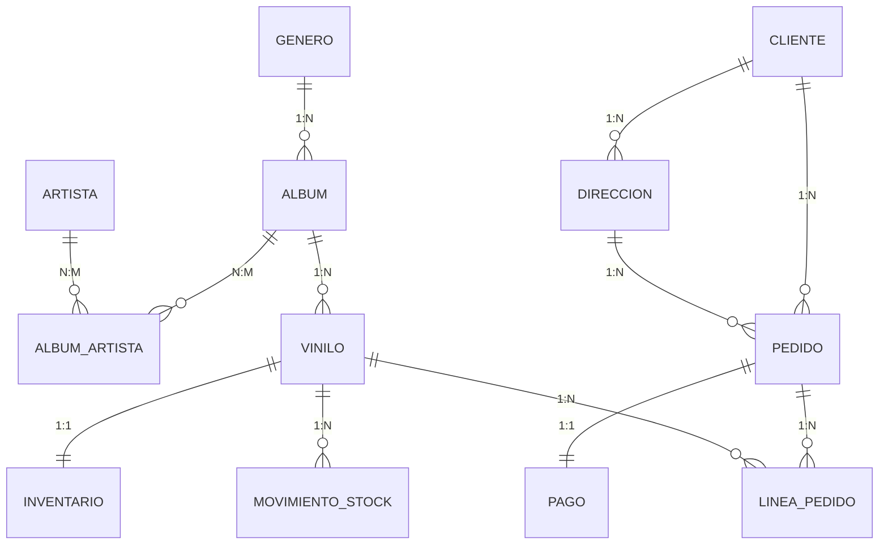

# Modelo entidad-relación

```mermaid
erDiagram
    GENERO ||--o{ ALBUM : "1:N"
    ALBUM ||--o{ ALBUM_ARTISTA : "N:M"
    ARTISTA ||--o{ ALBUM_ARTISTA : "N:M"
    ALBUM ||--o{ VINILO : "1:N"
    VINILO ||--|| INVENTARIO : "1:1"
    VINILO ||--o{ MOVIMIENTO_STOCK : "1:N"
    CLIENTE ||--o{ DIRECCION : "1:N"
    CLIENTE ||--o{ PEDIDO : "1:N"
    DIRECCION ||--o{ PEDIDO : "1:N"
    PEDIDO ||--|| PAGO : "1:1"
    PEDIDO ||--o{ LINEA_PEDIDO : "1:N"
    VINILO ||--o{ LINEA_PEDIDO : "1:N"
```